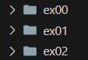
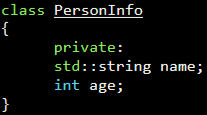

# Exercise Rules

### Compilation and Output
- Compile with `c++ -Wall -Wextra -Werror -std=c++98`
- Output must end with a newline  

### Naming Convention
- Each exercise must be inside a folder named: `ex00`, `ex01`, ..., `ex##`

    
- Use **PascalCase** format for class names  
- Files containing classes must be named the same as the class

    

### Class Design
- From **module 2 to 9**: Follow Orthodox Canonical Form, which includes:  
  1. Default constructor  
  2. Copy constructor  
  3. Copy assignment operator  
  4. Destructor  
- Split class into 2 files:  
  1. **Header (.hpp):** For class definition  
  2. **Source (.cpp):** For class implementation  
- Class headers must be independent. Include necessary `dependencies` and use include `guards` to avoid double inclusion  

### Allowed
- Preferred C++ version of the C function (e.g., use `std::cout` instead of `printf`)  
- Most of the C++ standard libraries are allowed unless explicitly forbidden in the exercise

### Forbidden
- External libraries (e.g., Boost) are not allowed  
- `printf()`, `*alloc()`, and `free()` are forbidden. Use `cout`, `new`, and `delete` instead  
- `Namespace` and `friend` keywords are also forbidden unless specified  
- From **module 0 to 7**: `<algorithm>` header and containers like `vector`, `list`, `map` are prohibited (allowed in module 8 & 9)  

---

### **Important!**  
You are given freedom to structure and design your code as you like as long as it adheres to these rules.
