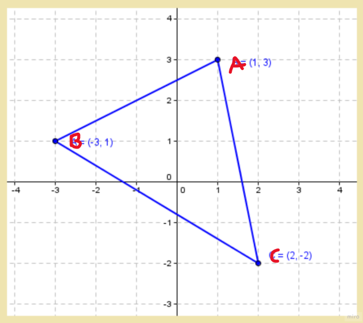

# Module 2 > ex03 > Binary space partitioning (BSP)

- **Turn in files**  : `Makefile`, `main.cpp`, `Fixed.hpp`, `Fixed.cpp`, `Point.hpp`, `Point.cpp`
- **Executable Name**: `./triangle(--Anything--)`
- **Allowed**        : `roundf (from <cmath>)`
- **Forbidden**        : `None`

## Class desgin (Add more feature from ex02)

**Class**: `Point`
- Private
    - `Fixed const attribute x`
    - `Fixed const attribute y`

- Public: 
    - `Default constructor`:  initializes x and y to 0
    - `Parameterized Constructor`: two constant floating-point numbers which initializes x and y
    - `Copy constructor`
    - `copy assignment operator overload.`
    - `Destructor`

## 📝Program Behaviour
- Using the Fixed & Point class, implement a function which indicates whether a point is inside of a triangle or not
- function prototype: `bool bsp( Point const a, Point const b, Point const c, Point const point)`
    - a,b,c are triangle vertices
    - return `TRUE` if inside the triangle. Otherwise `FALSE`
    - If point is a vertex or on edge, also return `FALSE`

## 🤔Lesson learned
- How to determine if a point in 2D space is inside the area of a triangle
- Find area of a triangle with 3 vertices
- Source: <https://www.youtube.com/watch?v=qObJQesvZUU>

## 🧪Expected Results

